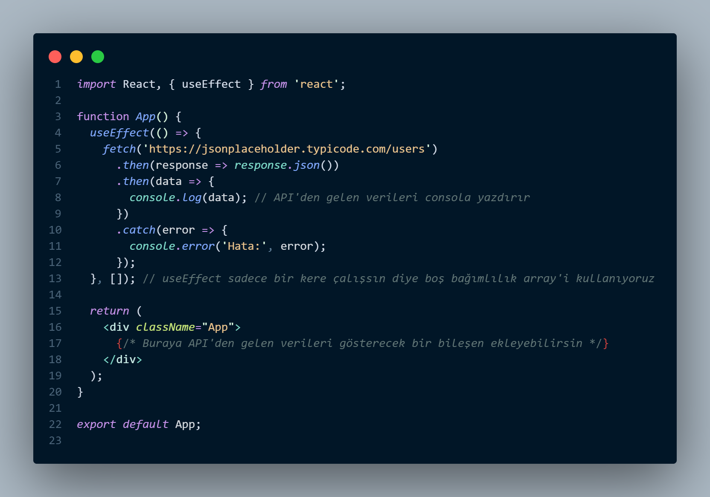

# React Projesi

Bu proje, React kullanarak bir web uygulaması geliştirmek için oluşturulmuştur. Proje içerisinde, bir fake API'den veri çekilerek kullanıcıların listelendiği bir örnek bulunmaktadır.

## Nasıl Çalıştırılır

1. Projenin klonunu alın:

    ```
    git clone https://github.com/Yusuf-Osmanoglu/Patika-React-FakeApi.git
    ```

2. Proje dizinine gidin:

    ```
    cd react-projesi
    ```

3. Gerekli bağımlılıkları yükleyin:

    ```
    npm install
    ```

4. Projeyi başlatın:

    ```
    npm start
    ```

## Kullanılan Teknolojiler

- React
- Fetch (fake API'ye istek yapmak için)
- CSS (stil ve tasarım)

## Ekran Görüntüsü




Bu projede, `src` dizini içerisinde bulunan `components` dizininde kullanıcı listesini gösteren bir bileşen bulunmaktadır. Ana uygulama dosyası `App.js` içerisinde bulunmaktadır.

## Katkıda Bulunma

Her türlü geri bildirimi ve katkıyı memnuniyetle karşılıyoruz. Lütfen bir [issue](https://github.com/kullanici/react-projesi/issues) açın veya bir [pull request](https://github.com/kullanici/react-projesi/pulls) gönderin.

---

# React Project

This project is created to develop a web application using React. Within the project, there is an example of listing users by fetching data from a fake API.

## How to Run

1. Clone the project:

    ```
    git clone https://github.com/Yusuf-Osmanoglu/Patika-React-FakeApi.git
    ```

2. Navigate to the project directory:

    ```
    cd react-project
    ```

3. Install the dependencies:

    ```
    npm install
    ```

4. Start the project:

    ```
    npm start
    ```

## Technologies Used

- React
- Fetch (for making requests to the fake API)
- CSS (for styling and design)

## Screenshot


